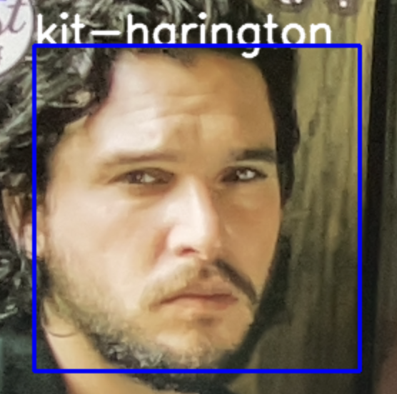

<br />
  <h2 align="center">Who Are You?</h2>
  <p align="center">
    Facial recognition application that uses machine learning to identify and recognize faces
    <br />
    <br />
    <a href="https://github.com/Momin-C/Who-Are-You/issues">Report Bug</a>
  </p>
</p>

[![LinkedIn][linkedin-shield]][linkedin-url]

## Table of Contents

* [About the Project](#about-the-project)
    * [Developed Using](#developed-using)
* [Screenshots](#screenshots)
* [Getting Started](#getting-started)
    * [Prerequisites](#prerequisites)
* [Contributing](#contributing)
* [References](#references)
* [Contact](#contact)

## About The Project

Who Are You? allows you to detect and recognize faces in real-time. Check out the repository files to find the labels, trainer and faces used as well as the application code. 

### Developed Using
This project was developed in Python using the following modules:
* [OpenCV](https://docs.opencv.org/4.5.2/d6/d00/tutorial_py_root.html)
* [NumPy](https://numpy.org)
* [Pillow](https://pillow.readthedocs.io/en/stable/)
* [Pickle](https://docs.python.org/3/library/pickle.html)
* [OS](https://docs.python.org/3/library/os.html)

## Screenshots

Demo screenshots using two faces can be seen below.




## Getting Started

### Prerequisites
To use this bot, some packages need to be installed, download these packages from your terminal
```sh
pip3 install numpy
pip3 install opencv-python
pip3 install Pillow
```

Then clone the repository

```sh
git clone https://github.com/Momin-C/Who-Are-You.git
```

Insert sample faces in the images folder, run the ```faces-train.py``` program and then ```faces.py``` to test out the model

## References

* Thanks to [CodingEntrepreneurs](https://www.youtube.com/watch?v=PmZ29Vta7Vc) for instructions on how to create the model
* Credit to othneildrew for the [README template](https://github.com/othneildrew/Best-README-Template/blob/master/BLANK_README.md)

## Contact

Momin Chaudhry - [@momin_c](https://instagram.com/momin_c) - hellomomins@yahoo.com

[linkedin-shield]: https://img.shields.io/badge/-LinkedIn-black.svg?style=flat-square&logo=linkedin&colorB=555
[linkedin-url]: https://www.linkedin.com/in/momin-chaudhry/